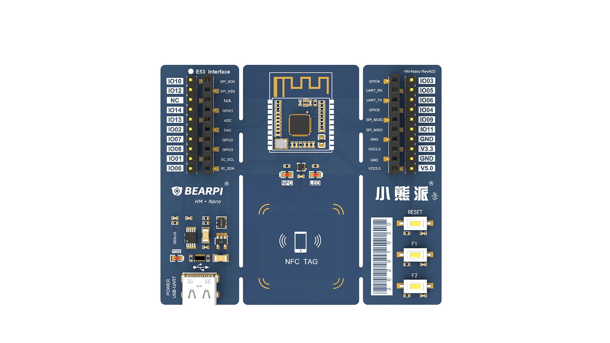
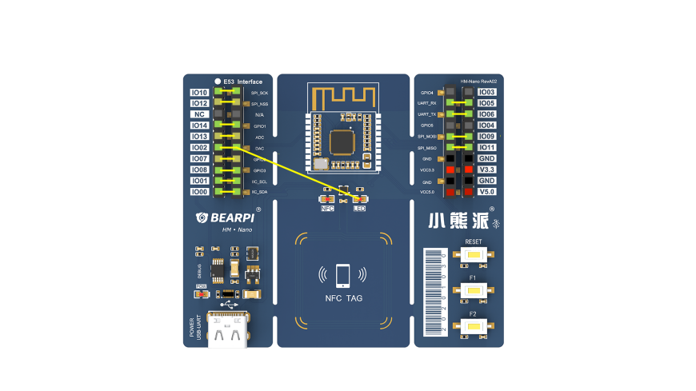
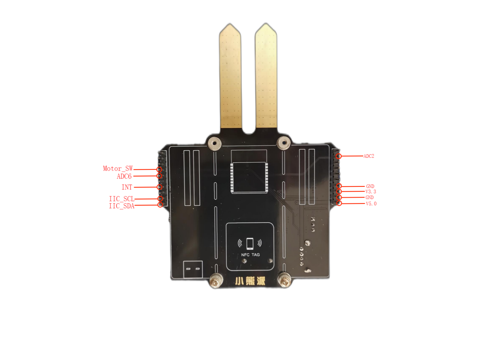
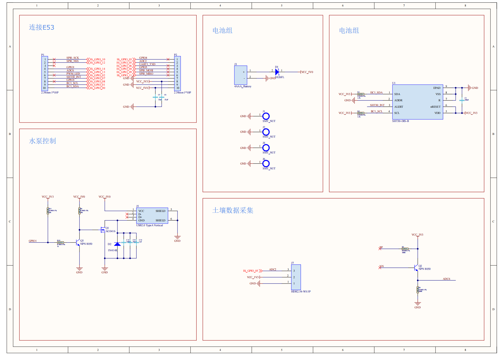
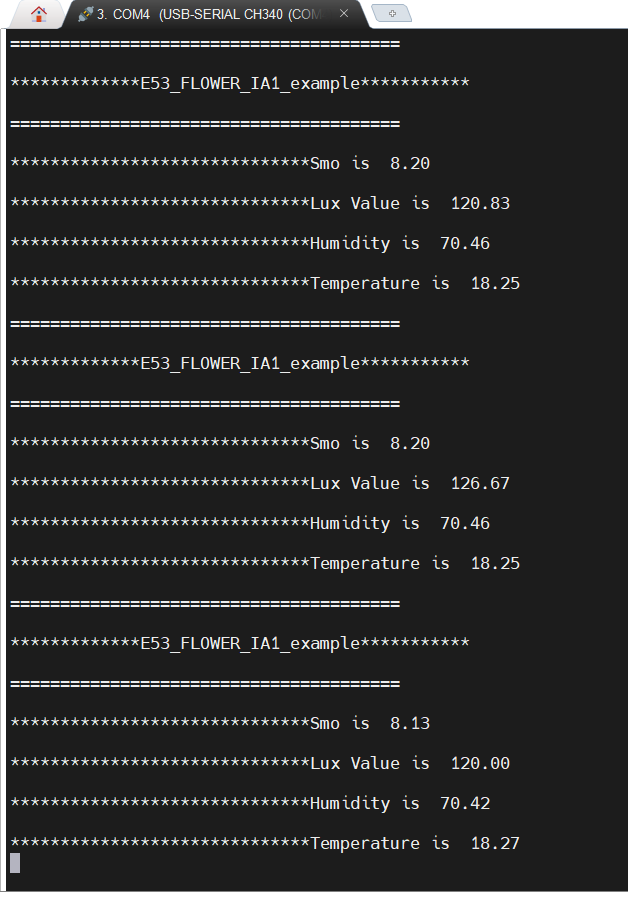

# BearPi-HM_Nano 护花使者案例教程（双扩展板集成方式）

本示例将分析和演示如何在BearPi-HM_Nano开发板上使用**E53_IA1**和“**护花使者**”双扩展板。



### BearPi-HM_Nano_E53内部引脚连线。



### 双拓展板集成问题分析：

由上图可以看出，在Nano板上许多引脚在出厂前已经被连接到了一起，所以我们想要实现两块拓展板的集成，**首先必须要注意的点就是不能出现接口同时占用的情况**，例如：当我们在代码中定义了GPIO 00/01分别复用为IIC_SDA和IIC_SCL是给E53_IA1用的，那么“护花使者”想要使用IIC就不能将“护花使者”底板的IIC接口接到GPIO 00/01上，否则就会出现信息传输错误的情况，原因在于GPIO 00/01接口被两个拓展板所占用，而主板不知道该读哪一块拓展板所传来的信息。所以如何解决**接口同时占用的问题**就成为了解决双拓展板集成的关键问题。


### 如何解决问题：

##### 1. 原理图分析

###### 1.1  E53_IA1原理图


| 序号 | 名称     | 方向   | 功能                                                         |
| ---- | -------- | ------ | ------------------------------------------------------------ |
| 1    | LED_SW   | OUT    | LED控制线                                                    |
| 2    | INT      | OUT    | 传感器数据信号中断                                           |
| 3    | Moter_SW | OUT    | 微型电机控制线                                               |
| 4    | IIC_SCL  | OUT/IN | 时钟线，传输时钟信号                                         |
| 5    | IIC_SDA  | OUT/IN | 数据线，传输数据信号                                         |
| 6    | GND      | PWR    | 电源地                                                       |
| 7    | V3.3     | PWR    | 电源，可输入 3.1V~4.2V，建议 3.3V，电源能够提供 500mA 驱动能力 |
| 8    | GND      | PWR    | 电源地                                                       |
| 9    | V5.0     | PWR    | 电源，建议5.0V                                               |


由E53_IA1原理图分析可得，当我们**只使用E53_IA1拓展板**时会占用Nano主板上的GPIO 00/01/08/07/14以及GND和VCC，共9个接口。

######  1.2  “护花使者” 原理图




| 序号 | 名称     | 方向   | 功能                                                         |
| ---- | -------- | ------ | ------------------------------------------------------------ |
| 1    | Motor_SW | OUT    | 抽水电机控制线（USB控制线）                                  |
| 2    | ADC6     | OUT    | AD转换（土壤湿度传感器）                                     |
| 3    | INT      | OUT    | 传感器数据信号中断                                           |
| 4    | IIC_SCL  | OUT/IN | 时钟线，传输时钟信号                                         |
| 5    | IIC_SDA  | OUT/IN | 数据线，传输数据信号                                         |
| 6    | ADC2     | OUT    | AD转换                                                       |
| 7    | GND      | PWR    | 电源地                                                       |
| 8    | V3.3     | PWR    | 电源，可输入 3.1V~4.2V，建议 3.3V，电源能够提供 500mA 驱动能力 |
| 9    | GND      | PWR    | 电源地                                                       |
| 10   | V5.0     | PWR    | 电源，建议5.0V                                               |




由“护花使者”原理图分析可得，当我们**只使用“护花使者”拓展板**时会占用Nano主板上的GPIO 00/01/07/13/14/05以及GND和VCC，共10个接口。

##### 2. 分析小结

由上述分析不难看出当我们想要实现双拓展板集成时，E53_IA1和“护花使者”会同时占用GPIO 00/01/07/14以及GND和VCC，共8个接口，不过我们可以不用考虑GND和VCC，所以接下来我们需要解决的问题就明确许多，在此就有两种解决方式：1、改变E53_IA1的GPIO 00/01/07/14接口；2、改变“护花使者”的GPIO 00/01/07/14接口。**建议使用第二种方法**，由于设备结构的原因，改变“护花使者”接口相对容易一些。

分析“护花使者”的GPIO 00/01/07/14接口，分别是IIC_SDA、IIC_SCL、INT、Motor_SW。在此我们需要先了解一下[**BearPi_HM Nano 芯片手册**](https://gitee.com/bearpi/bearpi-hm_nano/blob/master/applications/BearPi/BearPi-HM_Nano/docs/board/BearPi_HM%20Nano%20%E8%8A%AF%E7%89%87%E6%89%8B%E5%86%8C.pdf ) ,在Nano主板上IIC有两种IIC0和IIC1，当接口是GPIO 00/01时复用的IIC为IIC1，而IIC1已经挂载了E53_IA1，所以我们想要挂载“护花使者”就必须找到IIC0的接口，查看芯片手册可知GPIO 09/10复用的IIC为IIC0，以此类推解决别的接口占用也是同样的道理。

*值得注意的一点：在E53_IA1和“护花使者”上都具备了SHT30（温湿度传感器模块）但“护花使者”没有HB1750（光照强度传感器模块），所以如何取舍还得看个人如何分析。


### 代码分析：

##### 1.驱动代码编写

驱动的编写有两种方式：1、将两个模块分开编写；2、将两个模块看做整体一起编写。方式一的优点在于代码的可裁剪性强，但代码量就相对较多；方式二则相反。小编采取了相对轻松的方式二来解决驱动编写的问题。

接口定义：

```c
/***************************************************************
* 函数名称: Flower_IO_Init
* 说    明: Flower_GPIO初始化
* 参    数: 无
* 返 回 值: 无
***************************************************************/
static void Flower_IO_Init(void)
{

    IoSetFunc(WIFI_IOT_IO_NAME_GPIO_5, WIFI_IOT_IO_FUNC_GPIO_5_GPIO);//设置GPIO_5的复用功能为普通GPIO
    GpioSetDir(WIFI_IOT_IO_NAME_GPIO_5, WIFI_IOT_GPIO_DIR_OUT);//设置GPIO_5为输出模式

    IoSetFunc(WIFI_IOT_IO_NAME_GPIO_8, WIFI_IOT_IO_FUNC_GPIO_8_GPIO);//设置GPIO_8的复用功能为普通GPIO
    GpioSetDir(WIFI_IOT_IO_NAME_GPIO_8, WIFI_IOT_GPIO_DIR_OUT);//设置GPIO_8为输出模式
    
    IoSetFunc(WIFI_IOT_IO_NAME_GPIO_14, WIFI_IOT_IO_FUNC_GPIO_14_GPIO);//设置GPIO_14的复用功能为普通GPIO
    GpioSetDir(WIFI_IOT_IO_NAME_GPIO_14, WIFI_IOT_GPIO_DIR_OUT);//设置GPIO_14为输出模式

    IoSetFunc(WIFI_IOT_IO_NAME_GPIO_0, WIFI_IOT_IO_FUNC_GPIO_0_I2C1_SDA);   // GPIO_0复用为I2C1_SDA
    IoSetFunc(WIFI_IOT_IO_NAME_GPIO_1, WIFI_IOT_IO_FUNC_GPIO_1_I2C1_SCL);   // GPIO_1复用为I2C1_SCL
    IoSetFunc(WIFI_IOT_IO_NAME_GPIO_10, WIFI_IOT_IO_FUNC_GPIO_10_I2C0_SDA);   // GPIO_10复用为I2C1_SDA
    IoSetFunc(WIFI_IOT_IO_NAME_GPIO_9, WIFI_IOT_IO_FUNC_GPIO_9_I2C0_SCL);   // GPIO_9复用为I2C1_SCL

    I2cInit(WIFI_IOT_I2C_IDX_1, 400000); /* baudrate: 400kbps */
    I2cSetBaudrate(WIFI_IOT_I2C_IDX_1, 400000);
    I2cInit(WIFI_IOT_I2C_IDX_0, 400000); /* baudrate: 400kbps */
    I2cSetBaudrate(WIFI_IOT_I2C_IDX_0, 400000);
}
```

HB1750（光照强度传感器模块）来自E53_IA1

```c
/***************************************************************
* 函数名称: Init_BH1750
* 说    明: 写命令初始化BH1750
* 参    数: 无
* 返 回 值: 无
***************************************************************/
void Init_BH1750(void)
{
    WifiIotI2cData bh1750_i2c_data = { 0 };
    uint8_t send_data[1] = { 0x01 };
    bh1750_i2c_data.sendBuf = send_data;
    bh1750_i2c_data.sendLen = 1;
	I2cWrite(WIFI_IOT_I2C_IDX_1,(BH1750_Addr<<1)|0x00,&bh1750_i2c_data); 
}

/***************************************************************
* 函数名称: Start_BH1750
* 说    明: 启动BH1750
* 参    数: 无
* 返 回 值: 无
***************************************************************/
void Start_BH1750(void)
{
    WifiIotI2cData bh1750_i2c_data = { 0 };
    uint8_t send_data[1] = { 0x10 };
    bh1750_i2c_data.sendBuf = send_data;
    bh1750_i2c_data.sendLen = 1;
	I2cWrite(WIFI_IOT_I2C_IDX_1,(BH1750_Addr<<1)|0x00,&bh1750_i2c_data); 
}
```

SHT30（空气温湿度传感器模块）来自“护花使者”

```c
/***************************************************************
* 函数名称: SHT30_reset
* 说    明: SHT30复位
* 参    数: 无
* 返 回 值: 无
***************************************************************/
void SHT30_reset(void)
{
    WifiIotI2cData sht30_i2c_data = { 0 };
    uint8_t send_data[2] = { 0x30,0xA2 };
    sht30_i2c_data.sendBuf = send_data;
    sht30_i2c_data.sendLen = 2;
	I2cWrite(WIFI_IOT_I2C_IDX_0,(SHT30_Addr<<1)|0x00,&sht30_i2c_data); 
}

/***************************************************************
* 函数名称: Init_SHT30
* 说    明: 初始化SHT30，设置测量周期
* 参    数: 无
* 返 回 值: 无
***************************************************************/
void Init_SHT30(void)
{
    WifiIotI2cData sht30_i2c_data = { 0 };
    uint8_t send_data[2] = { 0x22,0x36 };
    sht30_i2c_data.sendBuf = send_data;
    sht30_i2c_data.sendLen = 2;
    I2cWrite(WIFI_IOT_I2C_IDX_0,(SHT30_Addr<<1)|0x00,&sht30_i2c_data); 
}

/***************************************************************
* 函数名称: SHT3x_CheckCrc
* 说    明: 检查数据正确性
* 参    数: data：读取到的数据
						nbrOfBytes：需要校验的数量
						checksum：读取到的校对比验值
* 返 回 值: 校验结果，0-成功		1-失败
***************************************************************/
static uint8_t SHT3x_CheckCrc(uint8_t data[], uint8_t nbrOfBytes, uint8_t checksum)
{
	
    uint8_t crc = 0xFF;
    uint8_t bit = 0;
    uint8_t byteCtr ;
	const int16_t POLYNOMIAL = 0x131;
    //calculates 8-Bit checksum with given polynomial
    for(byteCtr = 0; byteCtr < nbrOfBytes; ++byteCtr)
    {
        crc ^= (data[byteCtr]);
        for ( bit = 8; bit > 0; --bit)
        {
            if (crc & 0x80) crc = (crc << 1) ^ POLYNOMIAL;
            else crc = (crc << 1);
        }
    }
	
    if(crc != checksum)
		return 1;
    else
		return 0;
	
}

/***************************************************************
* 函数名称: SHT3x_CalcTemperatureC
* 说    明: 温度计算
* 参    数: u16sT：读取到的温度原始数据
* 返 回 值: 计算后的温度数据
***************************************************************/
static float SHT3x_CalcTemperatureC(uint16_t u16sT)
{
	
    float temperatureC = 0;            // variable for result

    u16sT &= ~0x0003;           // clear bits [1..0] (status bits)
    //-- calculate temperature [℃] --
    temperatureC = (175 * (float)u16sT / 65535 - 45); //T = -45 + 175 * rawValue / (2^16-1)
	
    return temperatureC;
	
}

/***************************************************************
* 函数名称: SHT3x_CalcRH
* 说    明: 湿度计算
* 参    数: u16sRH：读取到的湿度原始数据
* 返 回 值: 计算后的湿度数据
***************************************************************/
static float SHT3x_CalcRH(uint16_t u16sRH)
{
	
    float humidityRH = 0;              // variable for result
	
    u16sRH &= ~0x0003;          // clear bits [1..0] (status bits)
    //-- calculate relative humidity [%RH] --
    humidityRH = (100 * (float)u16sRH / 65535);  // RH = rawValue / (2^16-1) * 10
	
    return humidityRH;
	
}
```

设置抽水电机、风扇电机、补光灯

```c
/***************************************************************
* 函数名称: Motor_StatusSet
* 说    明: 电机状态设置
* 参    数: status,ENUM枚举的数据
*									CLOSE,关
*									OPEN,开
* 返 回 值: 无
***************************************************************/
void Motor_Flower_StatusSet(Flower_Status_ENUM status)
{
    if (status == OPEN)

        //设置GPIO_5输出高电平打开抽水电机
        GpioSetOutputVal(WIFI_IOT_GPIO_IDX_5, WIFI_IOT_GPIO_VALUE0);
    if (status == CLOSE)

        //设置GPIO_5输出低电平关闭抽水电机
        GpioSetOutputVal(WIFI_IOT_GPIO_IDX_5, WIFI_IOT_GPIO_VALUE1);
}

void Motor_Fan_StatusSet(Flower_Status_ENUM status)
{
    if (status == OPEN)

        //设置GPIO_8输出高电平打开风扇电机
        GpioSetOutputVal(WIFI_IOT_GPIO_IDX_8, WIFI_IOT_GPIO_VALUE1);
    if (status == CLOSE)

        //设置GPIO_8输出低电平关闭风扇电机
        GpioSetOutputVal(WIFI_IOT_GPIO_IDX_8, WIFI_IOT_GPIO_VALUE0);
}

void LED_Light_StatusSet(Flower_Status_ENUM status){
    if (status == OPEN)

        //设置GPIO_14输出高电平打开补光灯
        GpioSetOutputVal(WIFI_IOT_GPIO_IDX_14, WIFI_IOT_GPIO_VALUE1);
    if (status == CLOSE)

        //设置GPIO_14输出低电平关闭补光灯
        GpioSetOutputVal(WIFI_IOT_GPIO_IDX_14, WIFI_IOT_GPIO_VALUE0);
}
```

读取土壤湿度，光照强度，空气温湿度

```c
void Flower_Read_Data()
{
    unsigned int ret;
    unsigned short adc;

    ret = AdcRead(WIFI_IOT_ADC_CHANNEL_6, &adc, WIFI_IOT_ADC_EQU_MODEL_8, WIFI_IOT_ADC_CUR_BAIS_DEFAULT, 0xff); //读取土壤湿度
    if (ret != WIFI_IOT_SUCCESS)
    {
        printf("ADC Read Fail\n");
    }
    Flower_Data.Smo = (float)adc/1500*100;

    Start_BH1750(); // 启动光照强度传感器采集数据
	usleep(180000);
    WifiIotI2cData bh1750_i2c_data = { 0 };
    uint8_t recv_data[2] = { 0 };
    bh1750_i2c_data.receiveBuf = recv_data;
    bh1750_i2c_data.receiveLen = 2;
	I2cRead(WIFI_IOT_I2C_IDX_1, (BH1750_Addr<<1)|0x01,&bh1750_i2c_data);   // 读取光照强度传感器数据
	
    Flower_Data.Lux = (float)(((recv_data[0]<<8) + recv_data[1])/1.2);
    
    uint8_t  data[3];    //data array for checksum verification
    uint16_t dat,tmp;
    uint8_t SHT3X_Data_Buffer[6]; 				//byte 0,1 is temperature byte 4,5 is humidity
    
    WifiIotI2cData sht30_i2c_data = { 0 };
    uint8_t send_data[2] = { 0xE0,0x00};
    sht30_i2c_data.sendBuf = send_data;
    sht30_i2c_data.sendLen = 2;
    sht30_i2c_data.receiveBuf = SHT3X_Data_Buffer;
    sht30_i2c_data.receiveLen = 6;
	I2cWriteread(WIFI_IOT_I2C_IDX_0,(SHT30_Addr<<1)|0x00,&sht30_i2c_data); 	//Read SHT30 sensor data 
   //    /* check tem */
    data[0] = SHT3X_Data_Buffer[0];
    data[1] = SHT3X_Data_Buffer[1];
    data[2] = SHT3X_Data_Buffer[2];

    tmp=SHT3x_CheckCrc(data, 2, data[2]);
    if( !tmp ) /* value is ture */
    {
        dat = ((uint16_t)data[0] << 8) | data[1];
        Flower_Data.Temperature = SHT3x_CalcTemperatureC( dat );    
    }
    
    //    /* check humidity */
    data[0] = SHT3X_Data_Buffer[3];
    data[1] = SHT3X_Data_Buffer[4];
    data[2] = SHT3X_Data_Buffer[5];

    tmp=SHT3x_CheckCrc(data, 2, data[2]);
    if( !tmp ) /* value is ture */
    {
        dat = ((uint16_t)data[0] << 8) | data[1];
        Flower_Data.Humidity = SHT3x_CalcRH( dat );    
    }
}
```

##### 2.业务代码编写

当中启动了读取土壤湿度、光照强度、空气温湿度以及启动风扇电机，其余的可自行扩展。

```c
static void Example_Task(void)
{
        Flower_Init();

    while (1)
    {
        printf("\r\n=======================================\r\n");
        printf("\r\n*************E53_FLOWER_IA1_example***********\r\n");
        printf("\r\n=======================================\r\n");

        Flower_Read_Data();

        printf("\r\n******************************Smo is  %.2f\r\n", Flower_Data.Smo);
        printf("\r\n******************************Lux Value is  %.2f\r\n", Flower_Data.Lux);
        printf("\r\n******************************Humidity is  %.2f\r\n", Flower_Data.Humidity);
        printf("\r\n******************************Temperature is  %.2f\r\n", Flower_Data.Temperature);

       if(Flower_Data.Temperature>10){
           Motor_Fan_StatusSet(OPEN);
       }else{
           Motor_Fan_StatusSet(CLOSE);
       }
        
        usleep(1000000);
    }
}
```

##### 3.编译脚本BUILD.gn

在BUILD.gn中添加如下代码：

```c
        #"C1_e53_sf1_mq2:e53_sf1_example",
        #"C2_e53_ia1_temp_humi_pls:e53_ia1_example",
        #"C3_e53_sc1_pls:e53_sc1_example",
        #"C4_e53_sc2_axis:e53_sc2_example",
        #"C5_e53_is1_infrared:e53_is1_example",
        "C6_e53_flower_ia1:e53_flower_ia1_example",
```


### 实验效果：

数据采集：



实验演示：


因为E53_IA1原装的风扇小不方便观察，所以小编改造了一下。