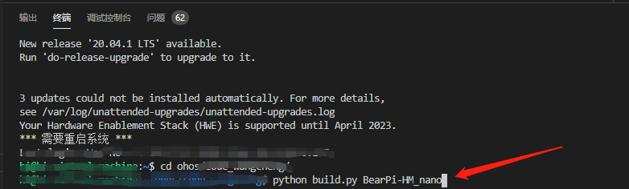

# BearPi-HM_Nano开发板如何烧录程序

本示例将演示如何给BearPi-HM_Nano开发板烧录程序。

## 源码获取

开发者需要在Linux服务器上下载一套源代码，获取BearPi-HM_Nano源码,源码获取方式，请见[源码获取](/applications/BearPi/BearPi-HM_Nano/docs/quick-start/源码获取.md)。

## 源码编译

本节介绍如何在Linux服务器上进行BearPi-HM_Nano开发板程序编译，整个过程包含如下步骤。

1.  使用OpenHarmony IDE工具DevEco的终端工具连接Linux服务器。（OpenHarmony IDE工具DevEco集成了终端工具的能力，基本使用请参考[指导文档](https://device.harmonyos.com/cn/docs/ide/user-guides/service_introduction-0000001050166905)）

    依次点击“View”、“Terminal”，打开IDE终端工具。

    **图 1**  IDE终端工具打开方法  
    

    

    在终端界面使用ssh命令连接linux服务器，如“ssh  _user_@_ipaddr_”，user请替换为服务器登录用户名，ipaddr请替换为服务器IP地址。

    **图 2**  终端界面示意图  
    

    

2.  进入代码根路径，并在终端窗口，执行编译脚本命令启动编译“`python build.py BearPi-HM_Nano`”。
    
    若是从hpm网站获取的代码，则编译命令为“`hpm dist`”

    **图 3**  在终端界面执行编译命令示意图  
    

    

3.  编译结束后，如果出现“BUILD SUCCESS”字样，则证明构建成功，如下图所示。

    **图 4**  编译成功示意图  
    

4.  构建成功后，会在./out/BearPi-HM_Nano/路径中生成以下文件，至此编译构建流程结束。

    **图 5**  编译文件存放目录示意图  
    

    

## 镜像烧录

BearPi-HM_Nano开发板的镜像烧录可以通过OpenHarmony IDE工具DevEco完成，工具的基本使用请参考[指导文档](https://device.harmonyos.com/cn/docs/ide/user-guides/service_introduction-0000001050166905)，烧录过程包含如下步骤。

1.  使用USB线连接Windows工作台和WLAN模组（需预先安装USB转串口驱动，安装时需要先连接模组，驱动下载地址：[http://www.wch.cn/search?q=ch340g&t=downloads](http://www.wch.cn/search?q=ch340g&t=downloads)），并查询设备管理器上的COM口，如CH340\(COM11\)，该串口集成了烧录、日志打印、AT命令等功能。

    **图 6**  设备管理器的COM口示意图  
    

2.  进入IDE烧录配置界面。

    **图 7**  烧录基础配置示意图  
    

    

3.  基础参数配置如下。

    1.  在Baud rate中选择合适的波特率，波特率越高烧写速度越快，此处建议使用921600。
    2.  在Data bit中选择数据位，WLAN模组默认为8，此处与其保持一致即可。
    3.  选择版本包路径“./out/BearPi\-HM\_nano/Hi3861\_wifiiot\_app\_allinone.bin”。
    4.  点击Save保存配置。

    **图 8**  波特率和数据位配置示意图  
    

    **图 9**  烧录包路径示意图  
    

    

4.  在DecEco工具界面中单击“烧录”按钮，然后选择烧录串口“COM11”。

    **图 10**  烧录启动示意图  
    

5.  选择串口后，IDE的TERMINAL对话框中出现“Connecting, please reset device...”的字样，模组进入待烧录状态。

    **图 11**  烧录进行中示意图  
    

6.  按下开发板上的RESET键，开始烧写版本，等待TERMINAL对话框中出现“Execution Successful”字样，即烧录完成。

    **图 12**  烧录完成示意图  
    

    

